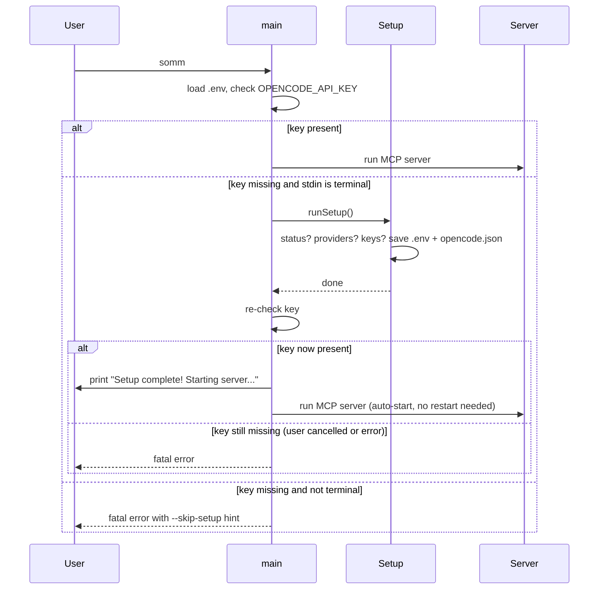

# Design: Auto-Setup Wizard

## Technical Approach

Introduce a small config pre-flight in `cmd/somm/main.go`. Before parsing flags or building the server, attempt to load `.env` and check whether `OPENCODE_API_KEY` is non-empty. If it is missing and stdin is a terminal, run the setup wizard; after the wizard completes successfully, print a confirmation message and **continue directly to MCP server startup** (no exit/restart required). If it is missing and stdin is not a terminal, print a fatal error. Add a `--skip-setup` flag for automation and tests.

Refactor `cmd/somm/setup.go` into clear phases: status check, provider multi-select, key prompts, save. Status mode triggers when `.env` and `opencode.json` are already configured, unless `--force` is used. The provider list always includes OpenCode as required and pre-selected, and OpenRouter and Kimi as optional. Save writes `.env` next to the resolved binary and patches `opencode.json`.

Add an optional `KIMAPIKey` field to `api.Client` and load it from `KIMI_API_KEY` in `main.go`; `ValidateConfig` reports it as a configured provider.

## Architecture Decisions

### Decision 1: Auto-setup is a pre-flight, not a server tool

The check lives in `main` before flag parsing so that `--skip-setup` can be honored and the MCP server never sees a TUI. The wizard is `runSetup()` as today.

### Decision 2: Non-interactive fallback is a fatal error

If stdin is not a terminal, the wizard cannot run. Instead of hanging, the system prints a clear message (including the `--skip-setup` hint) and exits. This preserves CI and scripts.

### Decision 3: Wizard completion auto-starts the server

After the setup wizard finishes successfully, `main` does NOT exit. It re-checks the config, prints a success message ("Setup complete! Starting server..."), and continues directly to MCP server startup. This gives users a seamless first-run experience: one command, no manual restart.

### Decision 4: `.env` stays next to the resolved binary

Both `main` and `setup` resolve the binary via `findBinary()` (GOPATH/bin or home/go/bin) or the path from `opencode.json`. The `.env` file is saved and loaded next to that binary, keeping dev and installed layouts consistent.

### Decision 5: Kimi key is stored but not yet consumed

`api.Client` receives the key to satisfy the wizard requirement and future provider-specific logic. Existing tools do not use it yet.

## Sequence Diagram



## File Changes

| File | Action | Description |
|------|--------|-------------|
| `cmd/somm/main.go` | Modify | `configReady()`, `maybeRunSetup()`, `--skip-setup` flag |
| `cmd/somm/setup.go` | Modify | Status check, provider multi-select, key prompts, `--force` |
| `internal/api/models.go` | Modify | Add `KIMAPIKey` to `Client` |
| `internal/api/api.go` | Modify | `NewClient` signature; `ValidateConfig` Kimi status |
| `cmd/somm/main_test.go` | Modify | Use `--skip-setup` for missing-key test |
| `cmd/somm/setup_test.go` | Create | Unit tests for status/selection/persistence helpers |

## Interfaces / Contracts

```go
// main.go
func configReady() bool
func maybeRunSetup() bool // runs wizard if needed; returns true if config is ready (wizard succeeded or was already ready)
func isTerminal() bool

// setup.go
func runSetup()
func runStatus(binaryPath, envPath string)
func runConfigurationFlow(binaryPath, envPath string)
func providersSelected() ([]string, error)

// api.go
func NewClient(hc *http.Client, ocKey, orKey, kimiKey string) *Client
```

## Testing Strategy

| Layer | What | Approach |
|-------|------|----------|
| Unit | `configReady`, `isTerminal`, `findBinary`, `findOpenCodeConfig` | Table tests with temp env/files |
| Unit | Setup wizard state machine | Test status/force/selection logic by extracting helpers |
| Integration | Smoke | `go build ./cmd/somm && ./somm --skip-setup` fails as before |
| E2E | Terminal behavior | Manual or scripted PTY that confirms wizard launches |

## Threat Matrix

- **TUI on non-terminal stdin**: handled by terminal check.
- **Writing to arbitrary binary dir**: only writes to resolved binary dir; no privilege escalation.

## Migration / Rollout

No migration. Existing `.env` files remain valid. Rollback: revert commits.
